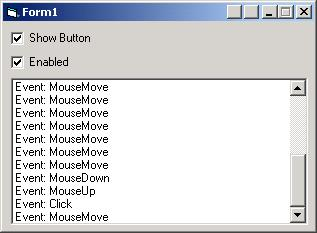



## CaptionButton Control

### Description

Have you ever wanted to display an extra button or two next to the minimize, maximize and close buttons? Now you can!

Just download this easy to use ActiveX control and you're done. Compile it (it's safer that way in the IDE) and just add some to your form.

The only thing you'll need to do manually is position the buttons on your window's caption bar (only if you have more than one), set a picture to use on it and you'll receive nice MouseMove, MouseUp, MouseDown and Click events from it, just like a normal button.

A test project is included, see the screenshot.
 
### More Info
 

             |
---                |---
**Submitted On**   |2002-07-19 11:14:26
**By**             |[Gerco Dries](https://github.com/Planet-Source-Code/PSCIndex/blob/master/ByAuthor/gerco-dries.md)
**Level**          |Advanced
**User Rating**    |5.0 (75 globes from 15 users)
**Compatibility**  |VB 6\.0
**Category**       |[Custom Controls/ Forms/  Menus](https://github.com/Planet-Source-Code/PSCIndex/blob/master/ByCategory/custom-controls-forms-menus__1-4.md)
**World**          |[Visual Basic](https://github.com/Planet-Source-Code/PSCIndex/blob/master/ByWorld/visual-basic.md)
**Archive File**   |[CaptionBut1080417192002\.zip](https://github.com/Planet-Source-Code/gerco-dries-captionbutton-control__1-37063/archive/master.zip)

